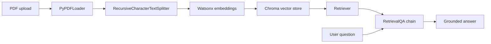

# Watsonx RAG PDF Chatbot

A retrieval-augmented generation app that lets users upload PDFs and ask questions answered from document context using LangChain, IBM watsonx.ai, Chroma, and Gradio.

This repository started as a set of hands-on labs about document loading, chunking, embeddings, vector databases, retrievers, and model interfaces. It has been restructured into a portfolio-ready project with the final RAG application at the top level and the original notebooks preserved as supporting learning material.

## Demo

Run the app locally, upload a PDF, and ask a question about its contents.

```text
PDF Upload -> Document Loader -> Text Splitter -> Embeddings -> Chroma -> Retriever -> Watsonx LLM -> Answer
```



## Features

- Upload a PDF through a Gradio web interface
- Load PDF pages with LangChain document loaders
- Split long documents into overlapping chunks
- Embed chunks with IBM watsonx.ai Slate embeddings
- Store vectors in Chroma for semantic retrieval
- Answer questions using a Watsonx Granite instruct model
- Keep the original lab notebooks as reproducible learning references

## Tech Stack

- Python
- LangChain
- IBM watsonx.ai
- Chroma
- Gradio
- PyPDF

## Project Structure

```text
.
├── app/
│   ├── config.py          # Environment-driven settings
│   ├── main.py            # Gradio app entry point
│   ├── rag_pipeline.py    # PDF loading, chunking, embeddings, retrieval, QA
│   └── ui.py              # Gradio interface
├── scripts/               # Cleaned standalone Python examples
│   ├── 01_document_loaders.py
│   ├── 02_context_window_limits.py
│   ├── 03_text_splitting.py
│   ├── 04_embeddings.py
│   ├── 05_vector_stores.py
│   └── 06_retrievers.py
├── requirements.txt
├── architecture.md
└── README.md
```

## Quickstart

1. Create and activate a virtual environment.

```bash
python3 -m venv .venv
source .venv/bin/activate
```

2. Install dependencies.

```bash
pip install -r requirements.txt
```

3. Configure watsonx.ai credentials.

```bash
cp .env.example .env
```

Then edit `.env` with your IBM watsonx.ai project settings.

4. Start the app.

```bash
python3 -m app.main
```

Open the local Gradio URL shown in the terminal, upload a PDF, and ask a question.

## Configuration

The app is configured through environment variables:

| Variable | Purpose |
| --- | --- |
| `WATSONX_URL` | IBM watsonx.ai service URL |
| `WATSONX_PROJECT_ID` | Your watsonx.ai project ID |
| `WATSONX_APIKEY` | Optional API key, depending on your runtime |
| `WATSONX_LLM_MODEL_ID` | LLM used for answer generation |
| `WATSONX_EMBEDDING_MODEL_ID` | Embedding model used for document vectors |
| `CHUNK_SIZE` | Character length for document chunks |
| `CHUNK_OVERLAP` | Overlap between neighboring chunks |
| `GRADIO_SERVER_NAME` | Local server host |
| `GRADIO_SERVER_PORT` | Local server port |

## How It Works

The RAG pipeline is implemented in `app/rag_pipeline.py`:

1. A user uploads a PDF.
2. `PyPDFLoader` extracts the document text.
3. `RecursiveCharacterTextSplitter` creates chunks that fit retrieval and model context limits.
4. `WatsonxEmbeddings` converts chunks into vectors.
5. Chroma stores the vectors and performs semantic search.
6. LangChain's `RetrievalQA` chain sends the retrieved context and question to the LLM.
7. The model returns an answer grounded in the uploaded document.

## Example Questions

After uploading a technical PDF, try questions like:

- What is the main contribution of this document?
- Summarize the key methods discussed.
- What limitations or risks does the document mention?
- Which section explains the implementation approach?

## Future Improvements

- Return source citations with page numbers
- Persist Chroma indexes between sessions
- Support multi-file upload
- Add streaming model responses
- Add automated evaluation questions
- Package the app with Docker
- Deploy the demo to Hugging Face Spaces, IBM Code Engine, or another hosted runtime

## Project Takeaway

This project demonstrates the full RAG workflow: ingestion, chunking, embedding, vector search, retrieval, answer generation, and UI integration.

## License

This project is licensed under the Apache License 2.0. See the `LICENSE` file for details.
